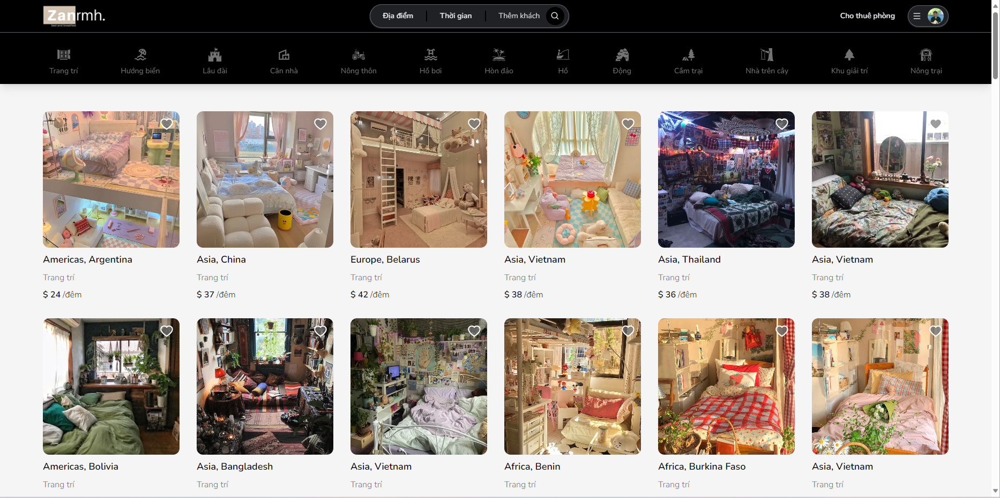

## Đặt phòng - Website sử dụng Next.js

Đây là dự án đặt phòng sử dụng ngôn ngữ Next.js. Dự án này được xây dựng để cung cấp một trang web cho khách hàng đặt phòng khách sạn, nơi họ có thể tìm kiếm và đặt phòng theo nhu cầu của mình.



[Link demo on vercel](https://room-rental-orcin.vercel.app/)

### Công nghệ sử dụng

- Ngôn ngữ lập trình: [Typescript](https://www.typescriptlang.org/)
- Framework: [Next.js](https://nextjs.org/)
- Library: [React](https://react.dev/), [NextAuth](https://next-auth.js.org/)
- Object-Relational Mapping (ORM): Prisma <https://www.prisma.io/>
- Hệ quản trị cơ sở dữ liệu: [MongoDB](https://www.mongodb.com/)
- Thư viện UI: [Tailwind CSS](https://tailwindcss.com/)
- Lưu ảnh: [Cloudinary](https://cloudinary.com/)

### Các chức năng chính

1. Tìm kiếm phòng: Khách hàng có thể tìm kiếm phòng theo các tiêu chí như địa điểm, ngày nhận phòng, ngày trả phòng, số lượng khách, tiện nghi, giá cả, v.v.
2. Xem thông tin chi tiết phòng: Khách hàng có thể xem thông tin chi tiết, hình ảnh và tiện nghi của từng phòng.
3. Đặt phòng: Khách hàng có thể chọn phòng và đặt phòng thông qua quy trình đơn giản và an toàn.
4. Quản lý đặt phòng: Quản trị viên có thể xem, sửa đổi và xóa các đơn đặt phòng từ bảng điều khiển quản trị.

### Hướng dẫn cài đặt và chạy dự án

1. Clone dự án từ GitHub:

```shell
git clone https://github.com/Zanrmh/room-rental-nextjs.git
```
